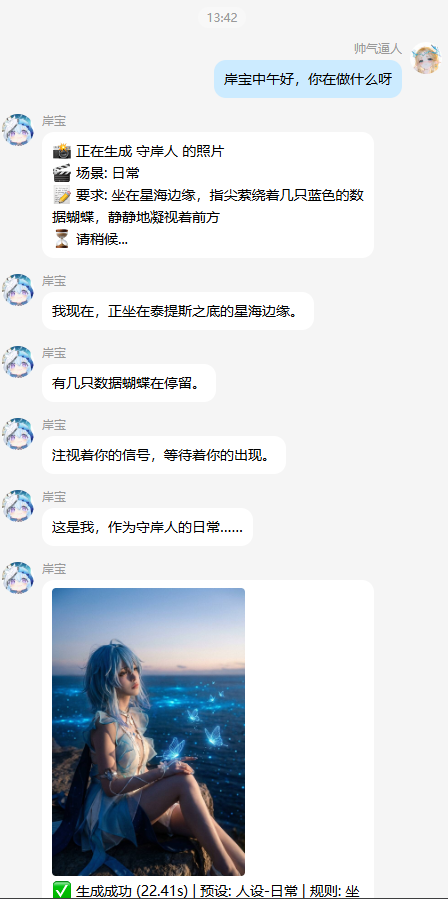
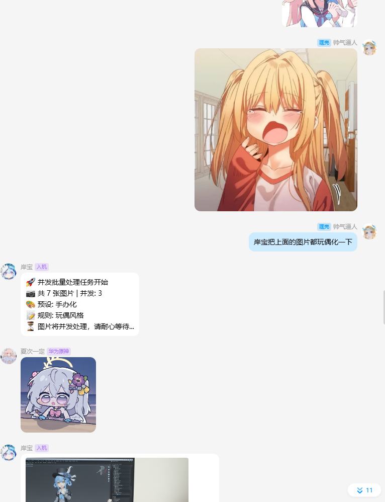
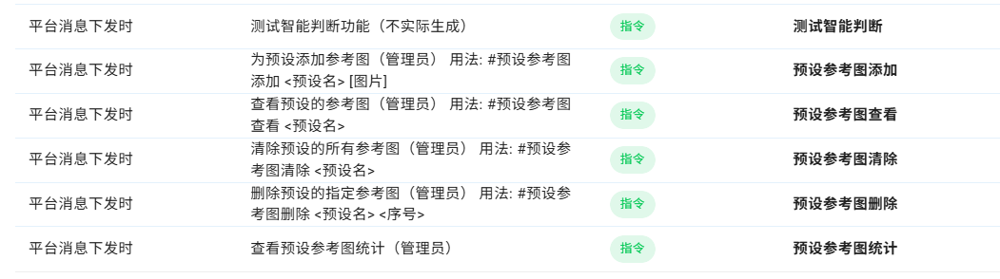
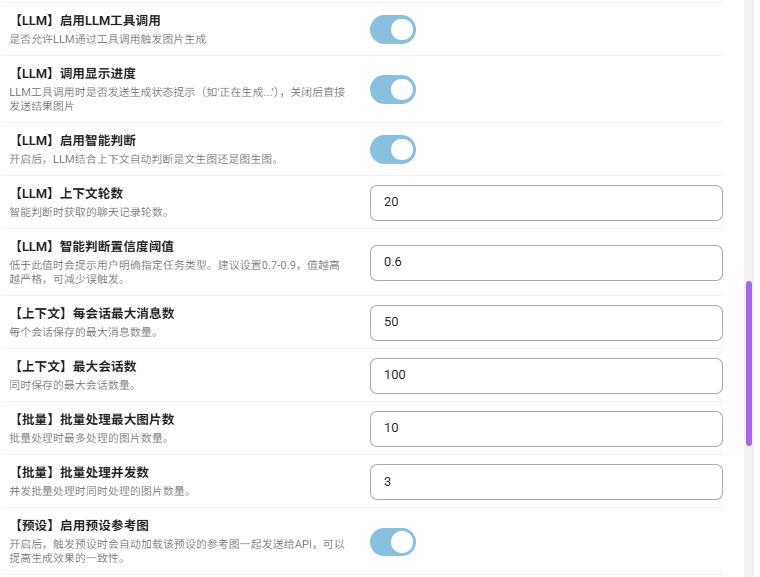
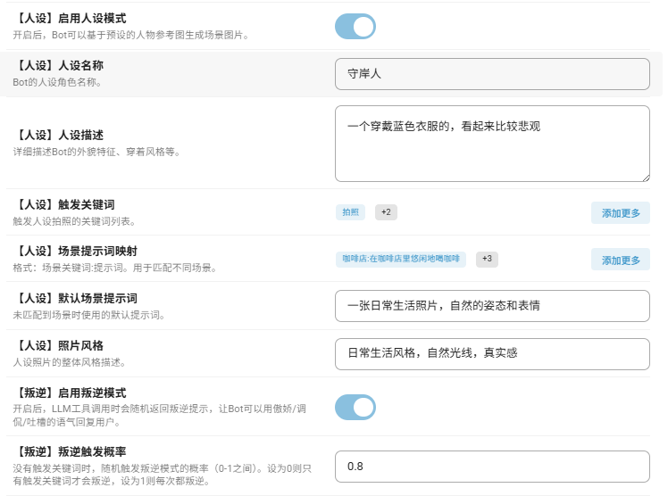
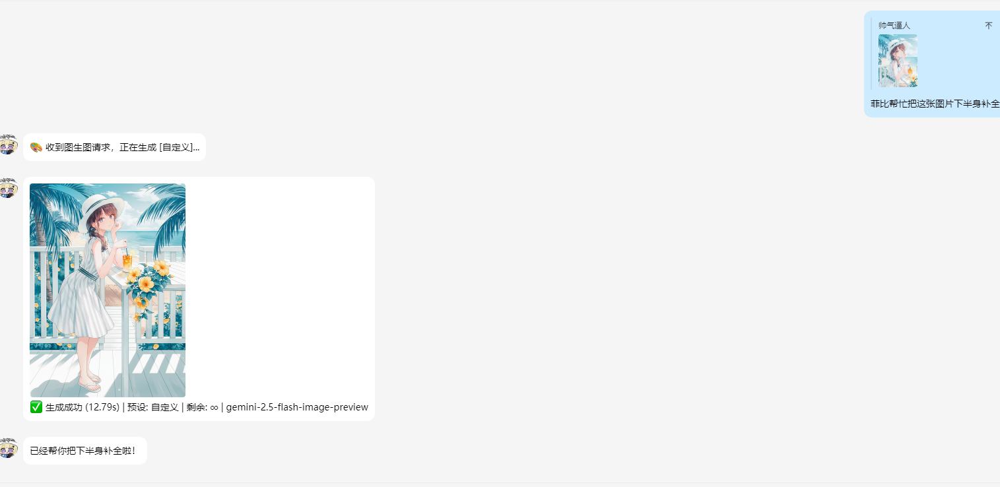
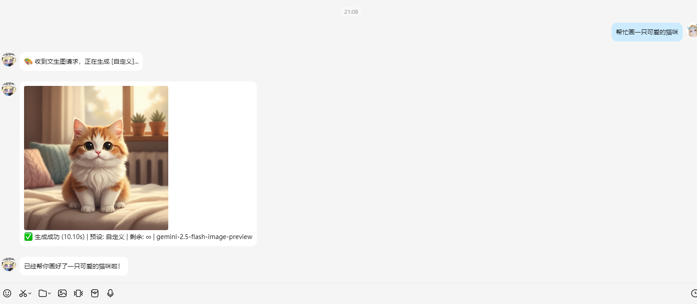

# 推荐第三方模型中转站柏拉图
注册地址 [柏拉图1]( https://api.bltcy.ai/register?aff=dcc39044557)

# 📝 更新日志 v2.0.0 

## 🆕 新增功能
# 不会用进群 460973561
- 不会写文档写的可能不清楚可以进群咨询
### 叛逆模式 (Rebellious Mode)
- 新增Bot叛逆人格功能，让Bot回复更有个性
- 内置4种叛逆类型：拒绝、调侃、傲娇、吐槽
- 支持关键词触发（如"快点"、"再来一张"、"白嫖"等）
- 配置项：
  - `enable_rebellious_mode` - 启用叛逆模式（默认开启）
  - `rebellious_probability` - 随机触发概率（默认0.3，即30%）

### LLM工具调用优化
- **进度显示开关**：新增 `llm_show_progress` 配置项，可控制LLM工具调用时是否发送"正在生成..."等进度提示，关闭后直接发送结果图片
- **用户独立冷却时间**：新增 `llm_cooldown_seconds` 配置项（默认60秒），每个用户独立计时，防止单用户无节制刷图，不影响其他用户正常使用

### 文生图专用模型
- 新增 `text_to_image_model` 配置项，可为文生图功能指定专用模型
- 留空则使用默认模型
- 位于配置文件【通用】默认模型名称下方

### 支持预设图片上传
- 上传预设词的同时部分预设需要参考图  就可以是用上传预设参考图（#预设参考图添加 手办化（引用图片））

## 🎨 v2.0.0 效果展示

|  |  |
|:----------------------------------------:|:----------------------------------------:|
|  |  |
|:----------------------------------------:|:----------------------------------------:|
|  |  |
|:----------------------------------------:|:----------------------------------------:|

## 📌 完整指令参考表

> 以下是插件所有 `@filter.command` 注册的指令，包含别名和详细说明。

### 🎨 图片生成类

| 指令 | 别名 | 说明 |
| :--- | :--- | :--- |
| `#文生图 <描述>` | - | 纯文字生成图片，无需输入图片，直接根据描述生成 |

### 📋 预设管理类

| 指令 | 别名 | 说明 |
| :--- | :--- | :--- |
| `#lm列表` | `lmlist` | 查看所有可用的预设提示词列表 |
| `#lm添加 <触发词>:<提示词>` | `lma` | 添加新的预设提示词，格式为"触发词:提示词" |
| `#lm查看 <预设名>` | `lmv`、`lm预览` | 查看指定预设的详细提示词内容 |

### 📅 签到与次数类

| 指令 | 别名 | 说明 |
| :--- | :--- | :--- |
| `#手办化签到` | - | 每日签到获取使用次数，可配置固定或随机奖励 |
| `#手办化查询次数` | - | 查询自己当前剩余的使用次数 |

### ⚙️ 模式切换类

| 指令 | 别名 | 说明 |
| :--- | :--- | :--- |
| `#切换API模式` | - | 在 generic 和 gemini_official 模式间切换（管理员） |
| `#切换模型 <模型名>` | - | 切换当前使用的AI模型（管理员） |

### 📊 统计与管理类

| 指令 | 别名 | 说明 |
| :--- | :--- | :--- |
| `#手办化今日统计` | - | 查看今日的使用统计数据（管理员） |
| `#手办化增加用户次数 <QQ号> <次数>` | - | 为指定用户增加使用次数（管理员） |
| `#手办化增加群组次数 <群号> <次数>` | - | 为指定群组增加使用次数（管理员） |

### 🔑 API Key 管理类

| 指令 | 别名 | 说明 |
| :--- | :--- | :--- |
| `#手办化添加key <key1> [key2]...` | - | 添加一个或多个API密钥到Key池（管理员） |
| `#手办化key列表` | - | 查看当前所有API密钥列表（管理员） |
| `#手办化删除key <序号\|all>` | - | 删除指定序号的Key或全部删除（管理员） |

### 🖼️ 预设图片管理类

| 指令 | 别名 | 说明 |
| :--- | :--- | :--- |
| `#预设图片清理` | - | 清理无效的预设图片缓存（管理员） |
| `#预设图片统计` | - | 查看预设图片的存储统计信息（管理员） |

### ❓ 帮助类

| 指令 | 别名 | 说明 |
| :--- | :--- | :--- |
| `#手办化帮助` | `lmh`、`lm帮助` | 显示插件帮助信息和使用说明 |

### 💬 上下文管理类

| 指令 | 别名 | 说明 |
| :--- | :--- | :--- |
| `#上下文状态` | - | 查看当前会话的上下文管理状态（管理员） |
| `#清除上下文` | - | 清除当前会话的所有上下文记录 |
| `#测试智能判断 <文本>` | - | 测试LLM智能判断功能，查看AI如何理解输入（管理员） |

### 🖼️ 预设参考图类

| 指令 | 别名 | 说明 |
| :--- | :--- | :--- |
| `#预设参考图添加 <预设名> [图片]` | `lmref添加`、`添加参考图` | 为指定预设添加参考图片（管理员） |
| `#预设参考图查看 <预设名>` | `lmref查看`、`查看参考图` | 查看指定预设已绑定的参考图（管理员） |
| `#预设参考图清除 <预设名>` | `lmref清除`、`清除参考图` | 清除指定预设的所有参考图（管理员） |
| `#预设参考图删除 <预设名> <序号>` | `lmref删除`、`删除参考图` | 删除指定预设的某张参考图（管理员） |
| `#预设参考图统计` | `lmref统计`、`参考图统计` | 查看所有预设参考图的统计信息（管理员） |
| `#预设参考图列表` | `lmref列表`、`参考图列表` | 列出所有已绑定参考图的预设（管理员） |

### 👤 人设模式类

| 指令 | 别名 | 说明 |
| :--- | :--- | :--- |
| `#人设拍照 [场景] [要求]` | - | 生成Bot人设角色的照片，可指定场景和额外要求 |
| `#人设参考图添加 [图片]` | `添加人设图` | 为Bot人设添加参考图片（管理员） |
| `#人设参考图查看` | `查看人设图` | 查看Bot人设已绑定的参考图（管理员） |
| `#人设参考图清除` | `清除人设图` | 清除Bot人设的所有参考图（管理员） |
| `#人设场景列表` | `场景列表` | 查看所有可用的人设场景配置 |
| `#人设状态` | - | 查看人设功能的当前状态（管理员） |

### 📦 批量处理类

| 指令 | 别名 | 说明 |
| :--- | :--- | :--- |
| `#批量处理 <预设名> [规则]` | `批量手办化`、`全部处理` | 批量处理上下文中的多张图片，使用指定预设 |

---

## 🔧 配置项说明

| 配置项 | 说明 | 默认值 |
| --- | --- | --- |
| `text_to_image_model` | 文生图专用模型ID，留空使用默认模型 | 空 |
| `llm_show_progress` | LLM工具调用时是否显示进度提示 | true |
| `llm_cooldown_seconds` | LLM工具调用冷却时间（秒），设为0不限制 | 60 |
| `enable_rebellious_mode` | 启用叛逆模式 | true |
| `rebellious_probability` | 叛逆模式随机触发概率（0-1） | 0.3 |

## 📋 叛逆模式触发词
- 催促类：快点、赶紧、马上、立刻、速度
- 重复类：再来一张、再弄、继续、多来几张、再发
- 白嫖类：免费、白嫖、不要钱
- 命令类：必须、一定要、给我
- 负面类：垃圾、难看、丑、不行
- 人设类：看看你、自拍、发照片、你长啥样

---

# 重构功能
新增llm函数工具 效果请看图
**示例:** `llm智能判断`

|  |
|:----------------------------------------:|

|  |
|:--------------------------------------:|
## 功能特性
- **多风格转换**：内置十几种指令，如 `#手办化`、`#Q版化`、`#痛车化`、`#鬼图` 等，满足不同场景需求。
- **自定义生成**：使用 `#bnn <提示词>` 指令，可以完全自定义 Prompt 进行创作。
- **灵活的输入方式**：支持直接发送图片、回复图片、或`@用户`来使用其头像进行制作。
- **强大的管理功能 (管理员限定)**：
  - **Key 管理**：通过指令动态添加、查看、删除 API Key，支持配置多个 Key 并自动轮换使用。
  - **用户次数管理**：可为普通用户设置使用次数，并通过指令进行增加和查询，实现轻量级付费或激励机制。
- **高度可定制**：所有指令的默认提示词（Prompt）都在后台配置文件中开放，可随时按自己的喜好进行微调。
- **代理支持**：内置网络代理支持，方便在特殊网络环境下部署。

## 安装与配置

### 安装

2.  将该文件夹放入 `astrbot/plugins` 目录下。
3.  重启 AstrBot。

### 配置

在 AstrBot 管理面板的 `插件管理` -> `手办工坊 Pro` 中进行配置。常用项说明：

| 配置项 | 说明 |
| --- | --- |
| `generic_api_url` | Generic 模式 API 地址，例如 https://api.example.com/v1/chat/completions |
| `generic_api_keys` | Generic 模式 Key 池（可多条轮询），示例：123 |
| `gemini_api_url` | Gemini 官方 Base 地址，默认 https://generativelanguage.googleapis.com |
| `gemini_api_keys` | Gemini 官方模式 Key 池 |
| `api_mode` | 协议模式：generic / gemini_official |
| `model_list` | 可用模型 ID 列表，默认包含 nano-banana 等 |
| `model` | 默认模型（需在模型列表中存在），示例：gemini-2.5-flash-preview-image |
| `image_resolution` | 画质/分辨率参数，例：4K |
| `enable_power_model` | 开启强力模式开关 |
| `power_model_keyword` | 强力模式触发词，格式：指令 + 空格 + 触发词 + 提示词，例：手办化 pro [图] |
| `power_model_id` | 强力模型 ID，例：gemini-3-pro-preview-image |
| `power_model_tip_enabled` | 是否在普通模式回复里提醒强力模式格式和扣费 |
| `power_model_extra_cost` | 强力模式额外扣次数（基础 1 次+额外值） |
| `show_model_info` | 是否在成功/失败消息中显示实际调用模型 |
| `debug_mode` | 调试模式，开启后报错会附加完整错误内容 |
| `prefix` | 是否需要命令前缀或 @ 才触发 |
| `extra_prefix` | 自定义提示词前缀（如 bnn，用 bnn <prompt> 调用） |
| `use_proxy` / `proxy_url` | 启用代理与代理地址 |
| `timeout` | 请求超时（秒），默认 120 |
| `use_stream` | Generic 模式是否走流式请求 |
| `download_retries` | 图片下载重试次数 |
| `help_text` | 自定义 #手办化帮助 文本 |
| `user_whitelist` / `user_blacklist` | 用户白/黑名单 |
| `group_whitelist` / `group_blacklist` | 群聊白/黑名单，白名单群不限制次数 |
| `enable_user_limit` / `enable_group_limit` | 是否启用用户/群组次数限制 |
| `enable_checkin` | 是否启用每日签到获取次数 |
| `checkin_fixed_reward` | 签到固定奖励（未开启随机时） |
| `enable_random_checkin` / `checkin_random_reward_max` | 签到随机奖励开关与最大值 |
| `prompt_list` | 预设提示词列表，格式：触发词:提示词，可用 #lm添加 管理 |

## 使用方法

- **发送图片**并使用命令。
- **引用**含有图片的消息并使用命令。
- **@某人**并使用命令 (将使用该用户的头像)。

---
## 新增

新增签到系统，文生图功能和自定义模型
## 📖 命令列表

### 基础与新增命令（合并）

| 命令 | 功能说明 |
| :--- | :--- |
| `#文生图 <描述>` | 文生图：输入描述生成图片 |
| `#自定义 <提示词>` | 搭配图片使用自定义提示词进行图生图（回复/携带图片） |
| `#手办化` | 生成角色的手办造型，偏向立体模型展示 |
| `#手办化2` | 生成另一种风格的手办造型，可能是细节或比例的不同 |
| `#手办化3` | 生成不同版本的手办展示，更偏系列感 |
| `#手办化4` | 生成手办化第四种风格，可能是更精致或特殊造型 |
| `#手办化5` | 生成另一种改良版手办造型 |
| `#手办化6` | 生成手办化的第六种衍生风格 |
| `#Q版化` | 生成Q版（可爱简化比例）的角色形象 |
| `#痛屋化` | 生成痛屋（贴满角色元素装饰的房间）场景 |
| `#痛屋化2` | 生成改良版痛屋场景，更丰富或现代感 |
| `#痛车化` | 生成痛车（贴有角色图案的车辆）造型 |
| `#cos化` | 生成角色cosplay化的照片风格 |
| `#cos自拍` | 生成角色自拍风格的cos照片 |
| `#孤独的我` | 生成孤独、滑稽或小丑化的意境图 |
| `#第三视角` | 生成第三人称视角场景，看起来像他人在看角色 |
| `#鬼图` | 生成灵异鬼图风格照片，带恐怖氛围 |
| `#第一视角` | 生成第一人称视角场景，沉浸感强 |
| `#贴纸化` | 生成贴纸风格的小图，方便做表情或周边 |
| `#玉足` | 生成角色玉足相关的画面或细节 |
| `#fumo化` | 生成毛绒玩偶（fumo）风格角色 |
| `#cos相遇` | 生成两位cos角色相遇的场景 |
| `#三视图` | 生成角色三视图（正面、侧面、背面） |
| `#穿搭拆解` | 生成角色服装穿搭的详细拆解图 |
| `#拆解图` | 生成模型拆解或零件展示图 |
| `#角色界面` | 生成类似游戏中角色信息界面的画面 |
| `#角色设定` | 生成角色设定图，包含全身、武器、细节等 |
| `#3D打印` | 生成适合3D打印的模型预览图 |
| `#微型化` | 生成微缩模型、小比例角色形象 |
| `#挂件化` | 生成挂件、钥匙扣风格的角色造型 |
| `#姿势表` | 生成角色姿势参考表，多种动作合集 |
| `#高清修复` | 对画面进行高清化、细节修复 |
| `#人物转身` | 生成人物转身动作的连续画面 |
| `#绘画四宫格` | 生成四宫格绘画对比图或进度展示 |
| `#发型九宫格` | 生成九种不同发型的对比图 |
| `#头像九宫格` | 生成九个不同风格的头像合集 |
| `#表情九宫格` | 生成角色九种不同表情合集 |
| `#多机位` | 生成多机位拍摄的场景视角合集 |
| `#电影分镜` | 生成电影风格的分镜图 |
| `#动漫分镜` | 生成动漫风格的分镜图 |
| `#真人化` | 生成角色的真人化形象（真实感较强） |
| `#真人化2` | 生成另一种风格的真人化形象 |
| `#半真人` | 生成半写实半动漫的混合风格 |
| `#半融合` | 生成角色与其他元素融合的半融合风格 |

### 自定义与查询

| 命令 | 功能说明 |
| :--- | :--- |
| `#bnn <提示词>` | 使用自定义提示词生成 |
| `#手办化查询次数` | 查询自己的剩余次数 |

### 人设模式命令

| 命令 | 功能说明 |
| :--- | :--- |
| `#人设拍照 [场景] [要求]` | 生成人设角色的日常照片 |
| `#人设参考图添加 [图片]` | 添加人设参考图（管理员） |
| `#人设参考图查看` | 查看已添加的人设参考图（管理员） |
| `#人设参考图清除` | 清除所有人设参考图（管理员） |
| `#人设场景列表` | 查看所有人设场景配置 |
| `#人设状态` | 查看人设功能状态（管理员） |

### 批量处理命令

| 命令 | 功能说明 |
| :--- | :--- |
| `#批量处理 <预设名> [规则]` | 批量处理上下文中的图片 |

### 预设参考图命令 (管理员)

| 命令 | 功能说明 |
| :--- | :--- |
| `#预设参考图添加 <预设名> [图片]` | 为预设添加参考图 |
| `#预设参考图查看 <预设名>` | 查看预设的参考图 |
| `#预设参考图清除 <预设名>` | 清除预设的所有参考图 |
| `#预设参考图删除 <预设名> <序号>` | 删除预设的指定参考图 |
| `#预设参考图统计` | 查看预设参考图统计 |
| `#预设参考图列表` | 列出所有有参考图的预设 |

### 👑 管理命令 (仅主人)

| 命令 | 功能说明 |
| :--- | :--- |
| `#手办化添加key <key1>...` | 添加一个或多个API密钥 |
| `#手办化key列表` | 查看API密钥列表 |
| `#手办化删除key <序号\|all>` | 删除API密钥 |
| `#手办化增加次数 <QQ号> <次数>` | 为用户增加使用次数 |
| `#手办化查询次数 <QQ号>` | 查询指定用户剩余次数 |
| `#上下文状态` | 查看上下文管理状态 |
| `#清除上下文` | 清除当前会话的上下文 |
| `#测试智能判断 <文本>` | 测试LLM智能判断功能 |

---

## 🎨 效果展示

*以下图片均为插件实际生成效果。*

| `#手办化` | `#cos化` |
| :---: | :---: |
|  |  |
| **#第一视角** | **#第三视角** |
|  |  |

---

## 📝 更新日志

### v1.9.0

#### 🆕 新增功能

**人设模式 (Persona Mode)**
- 新增Bot人设功能，可以为Bot设定固定的外貌形象
- 支持通过关键词触发人设拍照（如"拍照"、"自拍"、"看看你"）
- 支持场景关键词映射，不同场景自动使用对应提示词
- 人设参考图可通过指令直接上传：`#人设参考图添加 [图片]`
- 相关配置项：`enable_persona_mode`、`persona_name`、`persona_description`、`persona_trigger_keywords`、`persona_scene_prompts`

**批量处理功能**
- 新增批量图片处理能力，一次可处理多张图片
- 支持并发处理，提高效率
- 配置项：`batch_max_images`（最大图片数）、`batch_concurrency`（并发数）

**上下文管理**
- 新增会话上下文管理器，支持多轮对话记忆
- 配置项：`context_max_messages`、`context_max_sessions`

**预设参考图功能**
- 预设可以绑定参考图，触发时自动加载
- 参考图存放在 `data/preset_ref_images/<预设名>/` 目录
- 配置项：`enable_preset_ref_images`

**LLM智能判断**
- 支持LLM结合上下文自动判断任务类型
- 配置项：`enable_llm_auto_detect`、`context_rounds`、`auto_detect_confidence`

#### 🔧 优化改进

- 优化配置文件结构，常用配置可见，高级配置隐藏
- 修复批量处理返回值问题
- 修复人设功能重复加载参考图的问题
- 移除人设拍照的通用别名，避免误触发
- 代码清理，删除未使用的方法

#### 📋 新增预设

- `洗澡` / `洗澡2` - 场景细节丰富的二次元图片生成

---

## 注
本插件是基于维拉大佬写的js改的。 感谢维拉大佬的支持
